# Geany
Extras for https://www.geany.org/ text editor.

---

## Geany Startup Script

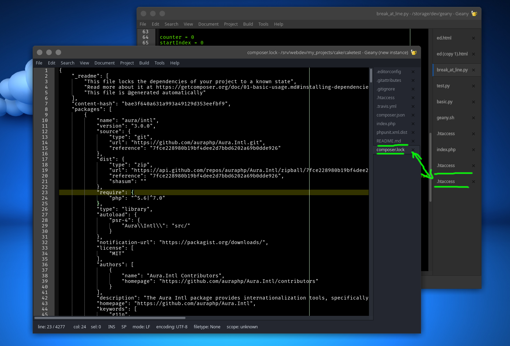

Script will start Geany with whatever theme you specify in bash 'start_geany.sh'.

If you are using light theme, you can start your Geany in dark theme. 

		#!/bin/sh
		#start geany with Arc-Darkest theme
		env GTK_THEME=Arc-Darkest geany %F

---

## Send Selection Commands

You can add commands from 'Edit->Format->Send Selection to' in Geany main menu.
When you select text in Geany, you can send it to bash script and get 
results passed back in. For example, 'html_entities.sh' will encode html and
pass back encoded string.

---

## Colorschemes

Copy colorschemes into ~/.config/geany/colorschemes/

Amigo:

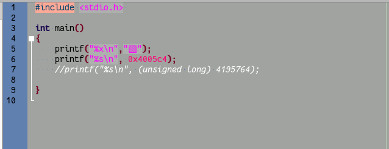

Anzu:

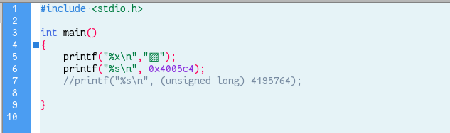

Battery_Acid:

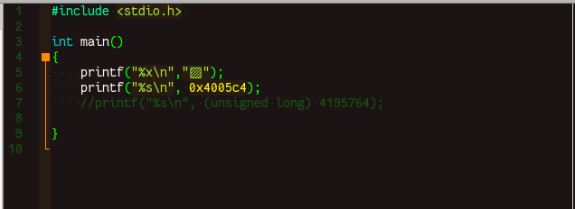

Control_Room:

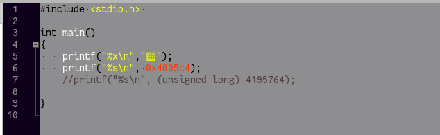

CSprite:

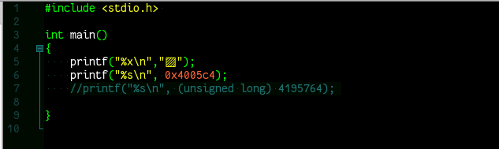

Dawnbringer:

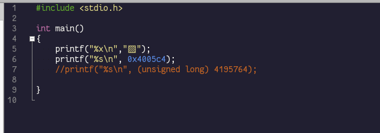

Deep_forest:

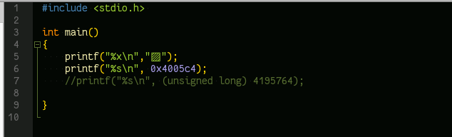

LightBringer:

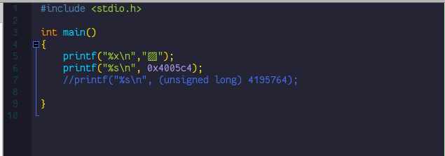

Metal:

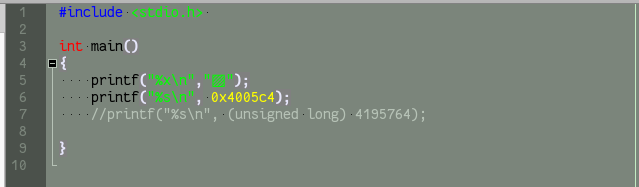

Vertex_Dark:

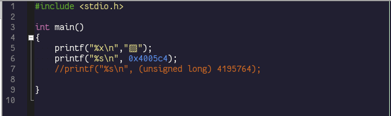
